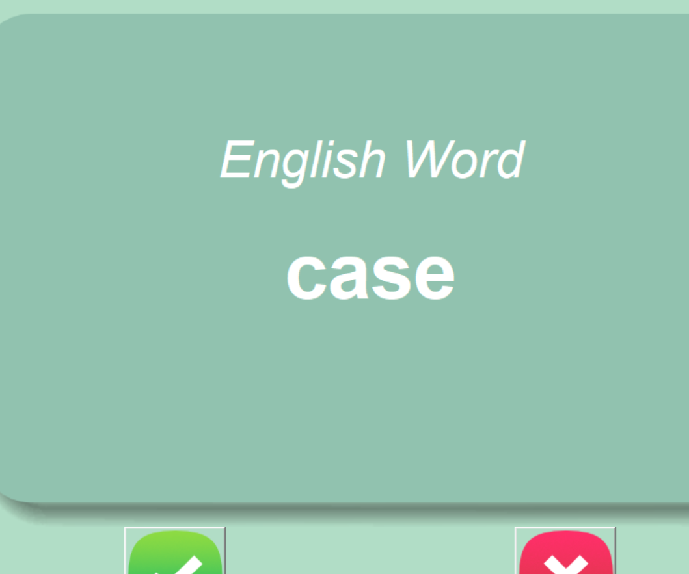

# Flash Card App



## Table of Contents

- [Description](#description)
- [Features](#features)
- [Requirements](#requirements)
- [Installation](#installation)
- [Usage](#usage)
- [Author](#author)

## Description
This is a simple flashcard application built using the Tkinter library in Python. The application 
displays French words and their English translations on flashcards. Users can interact with 
the flashcards and mark their familiarity with the words.

## Requirements
- Python 3.x
- Tkinter
- pandas

## Features

- Display French words and their English translations on flashcards.
- Automatically flip the flashcard to show the translation after a delay.
- Mark words as "known" to remove them from the list of words to learn.

## Installation
1. Clone the repository:
   ```bash
   git clone https://github.com/laurianerzb/flashcard_app.git
2. Navigate to the project directory:
   ```bash 
   cd flashcard_app
3. Run the application
   ```bash
   python flashcard_app.py

## Usage

- Upon starting the application, a flashcard with a French word will be displayed.
- After a delay of 3 seconds, the card will automatically flip to display the English translation.
- Click the "Right" button if you know the word, or the "Wrong" button if you don't.
- Clicking the "Right" button will mark the word as known and move to the next flashcard.
- Clicking the "Wrong" button will move to the next flashcard without marking the word as known.
- The application will continue displaying flashcards until all words have been displayed.

## Author
- [laurianerzb](https://github.com/laurianerzb)
